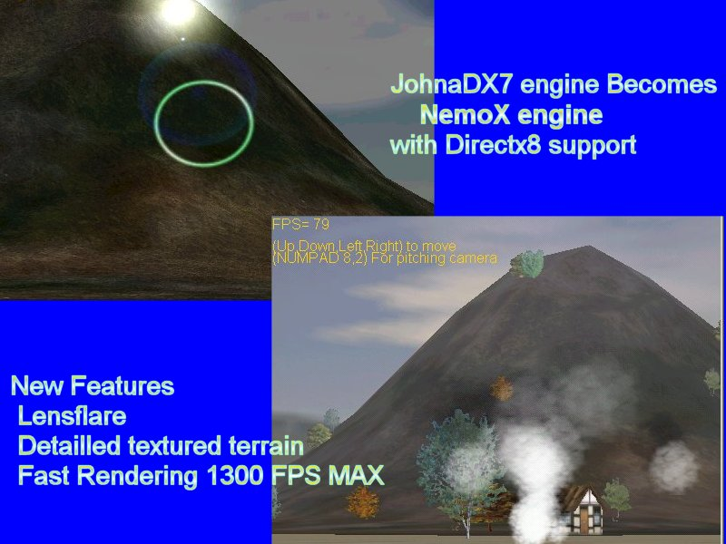



## NemoX 3d engine when JohnaDX7 is compatible fully with DirectX8

### Description

FIRSTLY I WANT TO UNDERLINE THAT I COULD NOT UPLOAD MY HUGE DEMO BECAUSE THE ZIP FILE IS ABOUT 2MEG SO YOU CAN GET IT AT

http://membres.lycos.fr/johnapop/NemoXengine.zip

This is the Adaptation of My JohnaDX7 3d engine

Now the engine is fully compatible with DirectX8

the rendering process is very fast

all the components were updated

New features like LensFlare,better Particle engine with RAIN,SNOW,EXPLOSION,SMOKE ect...

I'm waiting feedbacks and any comments to improve it,iF u like it vote for this project

Don't forget to download it at http://membres.lycos.fr/johnapop/NemoXengine.zip
 
### More Info
 

             |
---                |---
**Submitted On**   |2002-08-04 19:07:54
**By**             |[polaris](https://github.com/Planet-Source-Code/PSCIndex/blob/master/ByAuthor/polaris.md)
**Level**          |Advanced
**User Rating**    |4.0 (60 globes from 15 users)
**Compatibility**  |VB 4\.0 \(32\-bit\), VB 5\.0, VB 6\.0
**Category**       |[DirectX](https://github.com/Planet-Source-Code/PSCIndex/blob/master/ByCategory/directx__1-44.md)
**World**          |[Visual Basic](https://github.com/Planet-Source-Code/PSCIndex/blob/master/ByWorld/visual-basic.md)
**Archive File**   |[NemoX\_3d\_e114185842002\.zip](https://github.com/Planet-Source-Code/polaris-nemox-3d-engine-when-johnadx7-is-compatible-fully-with-directx8__1-37622/archive/master.zip)

